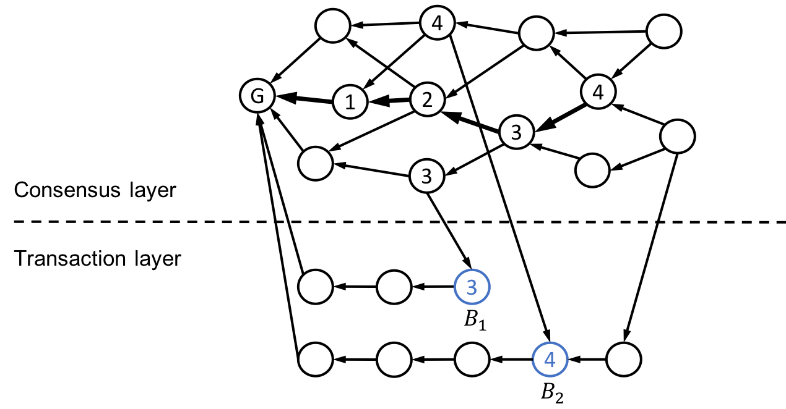

# 标准链介绍

物联网（Internet of Things）是一个具有技术，社会和经济意义的新兴主题。物联网对互联网和经济的影响的预测令人瞩目，一些人预计到2025年将有多达1000亿个连接的智能设备，对全球经济的影响超过11万亿美元。未来，整个物联网所产生的数据和依附于物联网的资产的总量将难以估算。

但是目前物联网的发展仍然存在着巨大的挑战，可能阻碍其发挥全部潜力。我们经常看到有关黑客攻击物联网设备的头条新闻，监视问题以及对隐私的担忧也已经引起了公众的关注。幸运的是，区块链技术正是解决许多此类问题的方法。区块链网络创建了一种安全且永久的方法来记录由物联网设备处理的数据。这种相互连接的设备网络除了能够安全可靠地存储收集到的数据外，还可以与环境交互并做出决策，而无需任何人工干预，而不会泄漏这些数据。

通过区块链技术给物联网带来的信任和安全，可以解决目前物联网业务中几个痛点的问题：

- 可扩展性：当前的物联网是一种集中式架构，具有许多瓶颈，无法进行大规模扩展：成本飞涨，系统拥塞，可靠性降低和服务器漏洞。在基于区块链网络的信任下，物联网设备可以以对等方式相互通信和交互，大大降低了成本并提高了交易的速度，这使物联网网络具有无限扩展的可能。
- 安全性：物联网生态系统中的任何故障都可能暴露多个设备和大量高度个人化的数据。这些安全漏洞通常围绕三个领域：身份验证，连接和事务。通过使用区块链来管理物联网设备对数据的访问，任何攻击者都将无法绕过新的安全层。
- 数据即资产：物联网边缘设备所产生的数据通常被提交并保留到在中心服务器中，这些数据被寡头垄断并且无法衡量其价值。区块链技术可以让设备产生的数据可以在可信透明的环境中得到分享，通过市场体现数据的价值。

标准链是一条以物联网设备作为节点，为物联网生态而构建可信高效的价值传输的公链。接入标准链的智能设备不仅可以共享算力或存储，还可以共享它们的数据和信用。标准链项目的愿景是，通过区块链技术将全球所有的物联网设备都整合在一起，成为一台配置灵活，可以处理海量数据和大规模事务，满足多种商业需求的超级计算机。

基于这一愿景，标准链团队在以下三个方面推动当前公链技术的边界。

- 更高的吞吐量和无限的存储量。在物联网中，应该快速处理并安全地存储大量交易和数据，这是构建物联网基础架构的基本要求。
- 更广的覆盖范围。不受硬件或软件限制的任何类型的物联网设备都可以连接到区块链网络。例如，许多边缘设备仅具有极少量的计算能力和存储空间，但它们处理重要数据，因此，为了提高安全性，它们应成为区块链网络的一部分。
- 效率和公平性。任何类型的设备都可以连接到标准链，并共享整个生态系统的优势。区块链必须激励所有设备共享其资源和数据。激励机制必须经过精心设计，以便设备可以最有效的方式进行协作。

标准链团队在第一代主网的开发过程中进行和很多创新，并把第一代主网命名为FLUID：即 *Fast*、*Light*、*United*、*Intelligent* 和 *Decentralized* 这五个英文单词的首字母缩写。

## R-DAG结构

基于DAG结构的公链是已被证明的具有适用于物联网应用场景，具有高并发性和吞吐量，同时可以有较低交易费的的技术。标准链的R-DAG技术是对传统DAG技术的一种深度优化，通过子区块在选择父区块时随机性的规则限制，使得整体的网络可以获得更好的性能。因此我们称之为一种规则化的DAG技术（*Regularized Directional Acyclic Graph*)。

	</img> 
	图1：R-DAG结构示例

在标准链中，每个区块代表一个交易，其中包含通过哈希对先前区块（称为父代）的引用。块及其父子链接分别是DAG的顶点和边缘。如图1所示，我们的R-DAG结构具有两层，即共识层和交易层。共识层中的所有块均由一些非匿名信誉良好的人或公司（称为见证人）组成，他们可能享有悠久的声誉，或在保持网络健康方面具有巨大好处。共识层中的每个块都可以引用共识层和事务层中的多个块。证人应经常发布交易并诚实行事。但是，完全信任任何一个证人都是不合理的。我们提出了一种在不损害网络共识和安全性的前提下替换证人的计划。 ??部分将详细介绍如何更换证人。共识层中的事务是在网络中达成共识的唯一目的，而实际事务发生在事务层中。在交易层，每个账户都有自己的区块链，该链记录了该账户的交易历史。交易层中的每个块只能由共识层中的块引用。

标准链网络中的共识是通过所有块的总排序来实现的。每个节点首先在其本地DAG的共识层内找到“稳定”主链。稳定主链的严格定义将在后面的第3.1节中介绍。然后，每个节点如下对稳定主链上的块所包括的所有块进行编号。它首先为直接位于稳定主链上的块定义索引。起源块
3

索引为0，主链上属于创世块的下一个块的索引为1，依此类推。通过沿稳定主链前进，它为位于稳定主链上的块分配索引。对于不在稳定主链上的任何块，其索引由稳定主链上首先直接或间接引用该块的块的索引分配。现在，每个节点都可以使用以下规则O确定具有指定索引的任意两个块B1和B2的顺序：当且仅当B1优先于B2
a）B1的索引低于B2；要么
b）B1和B2具有相同的索引，但B1直接由B2引用
或间接要么
c）B1和B2具有相同的索引，没有引用关系
在B1和B2之间，但B1的哈希值低于B2。
作为图1所示共识的一个具体示例，一个节点试图确定以蓝色标记的两个块B1和B2的顺序。找到的局部图的稳定主链用粗体箭头标记。并且每个块内的数字是根据稳定主链分配的索引。现在，块B1具有索引3，块B2具有索引4。因此，由于B1的索引比B2低，因此节点将确定B1在B2之前。

## 共识算法